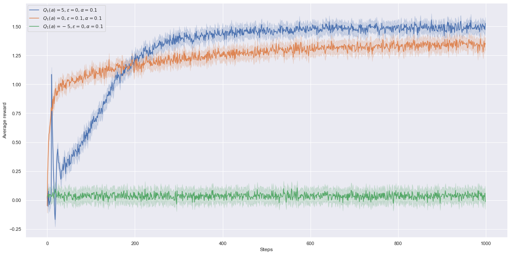
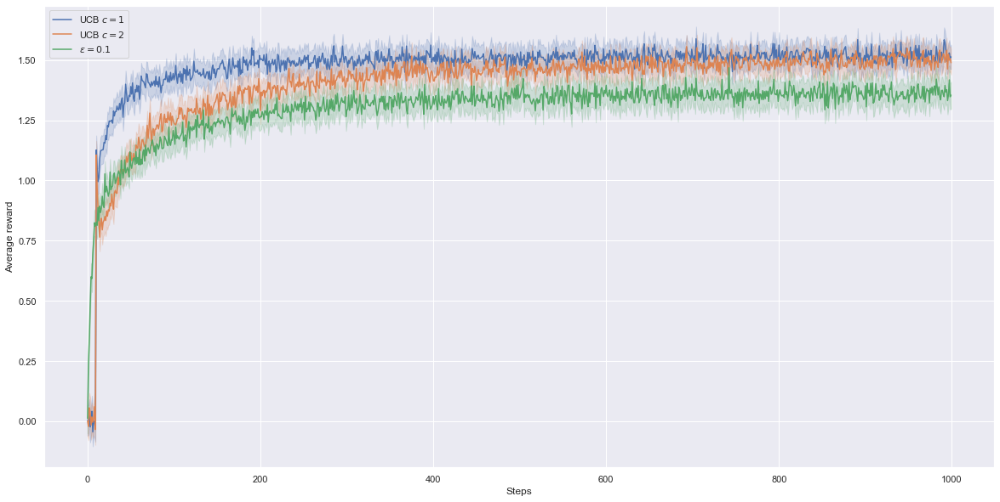
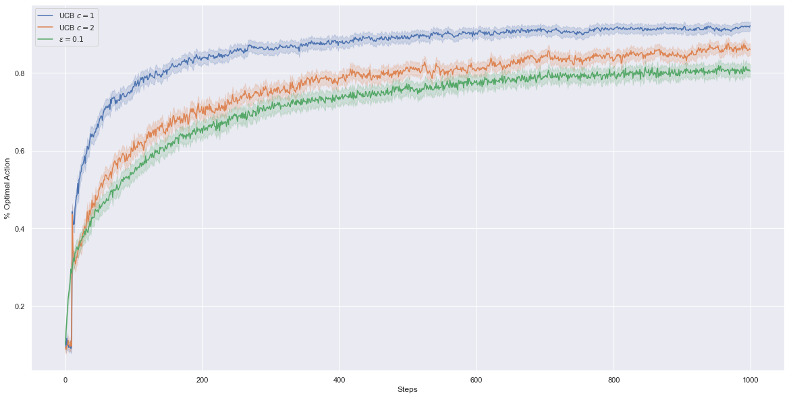

# 10-armed Testbed

---

We try to replicate a suite of test problems called 10-armed Testbed from Sutton and Barto's book as well as the numerical experiments showing the effects of epsilon-greedy methods, optimistic initial values estimates and Upper-Confidence-Bound (UCB) action selection method. In this `README.md`, we only focus on action-value methods, methods that first estimate the values of the actions and then use them to pick actions. Gradient bandit algorithm is explained quickly in the `gradient_bandit.md` file.

**Disclaimer:** My work is not necessarily free of mistakes. Please contact me if you see possible improvements so I can update the files.

**Note:** We broke ties randomly for the argmax instead of picking the first action all the time.

---

## Introduction

This introduction is explaining some concepts of Chapter 2 Multi-Armed Bandits.

### Exploration-Exploitation trade-off

The methods we're going to use try to balance the exploration-exploitation trade-off where at each action selection, the decision-maker has to choose whether to try actions in order to gain more information about their reward distributions (improving the estimates on how good the actions are and discovering potentially better actions but can also receive low short-term rewards while trying new actions) or to use current estimates of how good actions are (might take suboptimal actions).

### The set of problems

The set of problems uses 10-armed bandit problems where a 10-armed bandit problem has 10 actions (arms) to choose from and a single state/situation (not full reinforcement learning setting). At each time step, the decision-maker pulls an arm and receives a reward and the goal of the decision-maker is to maximize the amount of reward he can get by pulling arms.

We generate randomly 2000 independent different 10-armed bandit problems (the reward distributions of the actions can be different for each bandit problem but the reward distributions for a single bandit problem do not change over time, the problem is stationary.)
For each bandit problem, we generate 10 true action values from a normal distribution of mean 0 and unit variance (standard normal distribution) and each reward distribution is a normal distribution of unit variance and centered on action values previously generated.

We also limit the number of action selections (time steps or horizon) to 1000.

### Estimating action-values via sample-averages or exponential recency-weighted average

We try to estimate the true action values, the expected reward of each arm and use the estimates to pick actions (for instance greedily based on estimates or epsilon-greedily).

Action-value estimate for an action A can be for instance an empirical mean of all the rewards received when we pull that arm/action A (from an underlying reward distribution associated with the action) but it can also be an exponentially recency-weighted average by changing the step-size parameter in the incremental update rule to a constant value between 0 and 1. Constant step-size parameter estimation method does not satisfy Robbins Monro conditions from stochastic approximation theory but David Silver explains in lecture 5 (Model-Free Control) that it can still work well in practice in the general RL setting. 

The book explains that the constant step-size parameter can be useful for tracking nonstationary problems where reward distributions can change over time but is permanently biased towards initial estimates (see the trick below). Although exponentially recency-weighted average has a bias, it can be used on stationary problems to for instance make the agent explore more the actions as we're going to show in the Optimistic Initial Values estimates section.

#### Constant step-size trick on nonstationary problems

For nonstationary problems, the book explains a constant step-size trick in the exercises combining advantages of sample-average methods that do not have any initial bias after each action is selected at least once and of exponentially recency-weighted average that is useful to track nonstationary problems. The trick is to have a step-size parameter starting at 1 and decreasing towards a constant step-size that we fix. As effect, the initial bias disappears once all actions are selected at least once.

---

## Effectiveness of greedy or epsilon-greedy action-value methods

We try to compare numerically the effectiveness of greedy or epsilon greedy action-value methods.

At each time step, greedy methods are choosing actions having the current highest action value estimate while epsilon greedy methods pick a random action with probability epsilon or a greedy action with one minus epsilon (Epsilon can also decrease over time but we keep it constant, see Greedy in the Limit with Infinite Exploration for more details).
Epsilon-greedy methods are trying to balance exploration and exploitation but there are other methods as well in bandit problems such as Upper Confidence Bound that we'll see later.

Action-value estimate for an action A is in this case the empirical mean of all the rewards received when we pull that arm/action A (from an underlying reward distribution associated with the action). We try to estimate the true action values, the expected reward of each arm and use the estimates to pick actions with greedy or epsilon greedy methods.

### Average reward of epsilon-greedy action-value methods

The filled areas are for the [95% confidence interval](https://seaborn.pydata.org/generated/seaborn.lineplot.html). The blue curve is for the greedy method while the two other curves are for epsilon-greedy methods with some exploration rate.

We can observe that the greedy method seems bounded and stuck. This can be due to the method taking greedily suboptimal actions most of the time if current estimates are bad for the optimal action (because did not try enough the optimal action to get a good sense of how good it is) and can potentially never update estimates of actions with low values.

### Percentage of optimal action

The probability of taking the optimal action is the probability of : taking a greedy action or (choosing to take a random action and then taking the optimal action). In other words: 1 - eps + eps*1/(number of actions) (this formula only works if epsilon is not 0)

**The % optimal action means : for a particular time step; how many percent out of all runs did we take an optimal action ?**

It does not mean this : how many percent of all previous actions (for instance if we are at step 500, how many percent of the previous 500 actions) the method took the optimal action (the one with highest true action value). To obtain this we would have to divide not everything by the 1000 but by each time step element-wise.

Epsilon=0.01 increases slowly but will perform the best in the two plots.

### Remark(s) about implementation

In the implementation, we estimated the true action values (mean of the reward distribution for each action) by computing the empirical mean incrementally (by sample-averages).
To obtain the percentage of optimal action curve, we have to set 1's for the time steps where we took an optimal action then do averages time-step-wise.

---

## Optimistic Initial Values 

In this section, we try to observe the effects of optimistic initial values (bias caused by initial estimates) and instead of computing empirical means for estimated action values, <u>this part only uses exponentially recency-weighted average</u> (constant step size parameter).

As explained earlier, estimating using constant step size parameter keeps a permanent bias from the initial estimates while estimating using sample-averages only keeps the bias until all actions are selected at least once.

### Average reward of optimistic greedy, realistic epsilon-greedy and pessimistic greedy

Blue is for optimistic greedy, orange for realistic epsilon-greedy and green for pessimistic greedy

### Percentage of optimal action of optimistic greedy, realistic epsilon-greedy and pessimistic greedy

We can observe that, as in the book, optimistic greedy performs worse than realistic epsilon-greedy due the exploration (with greedy action selections ! ) at the beginning then performs better afterwards. The agent becomes "disappointed" in most of the rewards he gets at the beginning because his initial estimates were very optimistic (true action values have 0 mean and unit variance). For the same reason, for the 10 first actions, the decision-maker tried all actions greedily and this gives in average about 10 % optimal action.

### Remark(s) about implementation

We added "pessimistic greedy" method in green with initial estimates of -5 just to observe that if the decision-maker is pessimistic about all actions, the first time he tries an action, he gets a high reward and due to that, if the decision-maker follows a greedy strategy, he will end up stuck on that action and never try other actions. Over 2000 runs, due to the ties broken uniformly randomly, we obtain in average about 1/10 and this is the probability of taking the optimal action given by random uniform action selection (10 actions in total).

## Upper-Confidence-Bound

Upper-Confidence-Bound is non-parametric method based on the Hoeffding's inequality. The formula is defined in the book and David Silver shows in lecture 8 (on exploration-exploitation) how to derive it. Here it's only applied when we have stationary reward distributions.

The main idea of UCB is selecting actions greedily not based only on the estimates but on the potential of the action being optimal. We apply an argmax on: the current estimates plus some uncertainty term : argmax a (Q(a) + U(a)). When we pick an action, U(a) decreases (we become a bit more certain about the potential of the action being optimal or not) and when we pick another action instead of a, U(a) increases. The logarithm term in the numerator of U(a) shows that the increase in uncertainty is less and less (but still unbounded) (the denominator grows faster (asymptotically) than the numerator if both grows at the same time).

If we apply the formula blindly, we would be dividing by zero on actions that were never taken. The book explains that actions that were never taken before are maximizing actions (p. 36). Consequently, we include actions that were never taken before as maximizing actions (in the set prior to adding these actions, we had actions such that Q(a) + U(a) are maximal).

### Average reward of  UCB versus epsilon-greedy

Blue is for UCB with c=2, orange for c=1 and green for epsilon-greedy with epsilon=0.1

<u>Remark:</u> Although there's a spike around step 11 in the book that we don't see in our graph, the rest looks similar.

### Percentage of optimal action of  UCB versus epsilon-greedy

### Remark(s) about implementation

As said previously, we added actions that were never taken as maximizing actions.

