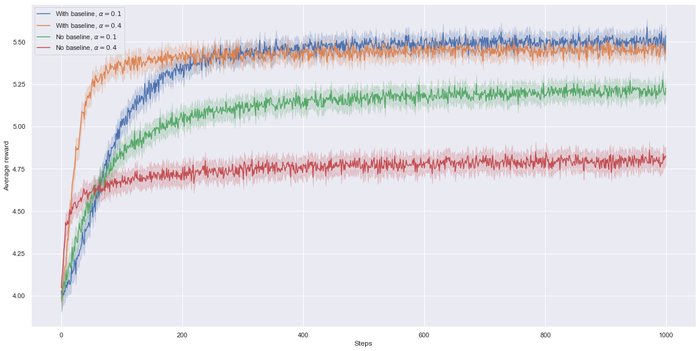
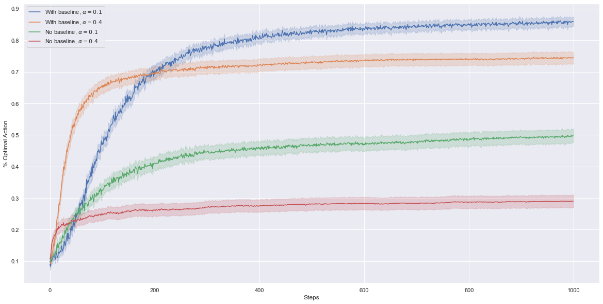

# Gradient Bandit Algorithm

Instead of estimating action values and then use those estimates to select actions (action-value methods), gradient bandit algorithm learns a numerical preference for each action.
Action selections are based on a soft-max distribution that uses the action preferences. The algorithm is an instance of Stochastic Gradient Ascent with the expected reward as performance measure.

We try to replicate Figure 2.5: Average performance of the gradient bandit algorithm with and without a reward
baseline on the 10-armed testbed when the q*(a) are chosen to be near +4 rather than near zero.

### Average reward of gradient bandit algorithm with or without reward baseline

### Percent optimal action of gradient bandit algorithm with or without reward baseline

We can observe that gradient bandit algorithm with baseline adapts better to the shift of the reward distributions than without baseline. The baseline affects the variance (as long as it does not depend on the action selected) (and the rate of convergence) but does not affect the expected update.
