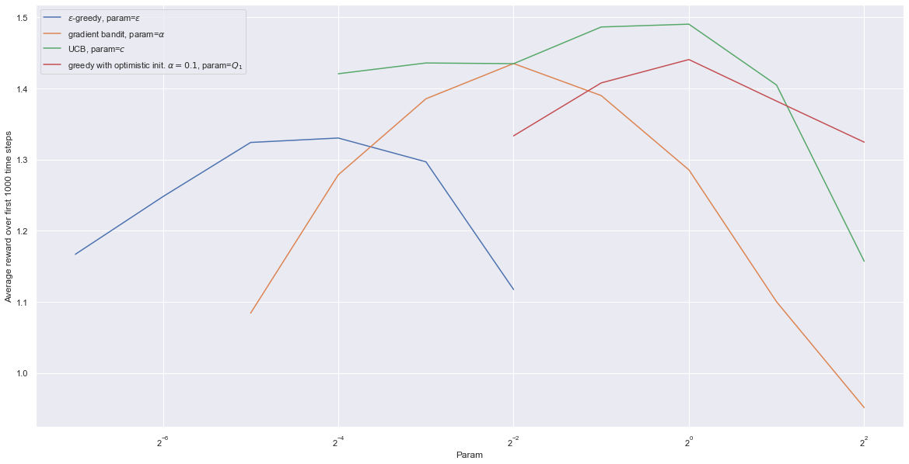

# Parameter Study for stationary case

We try to replicate the figure 2.6 (p. 32) : "A parameter study of the various bandit algorithms presented in this chapter.
Each point is the average reward obtained over 1000 steps with a particular algorithm at a
particular setting of its parameter."

