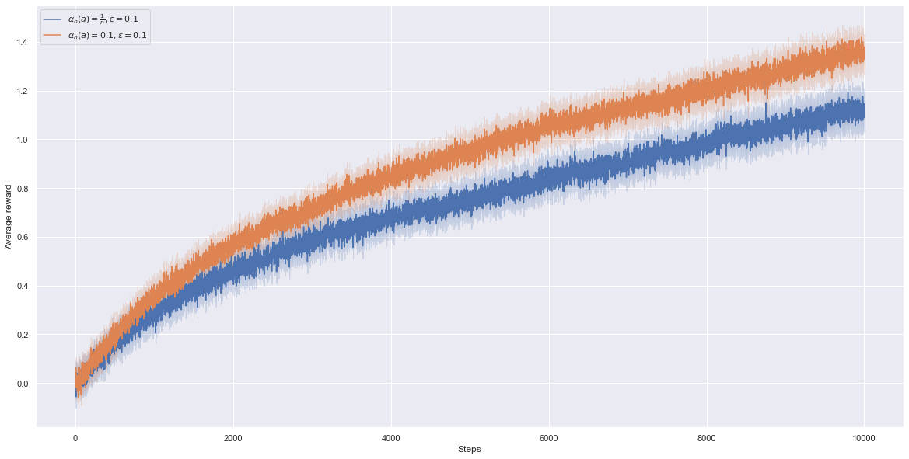
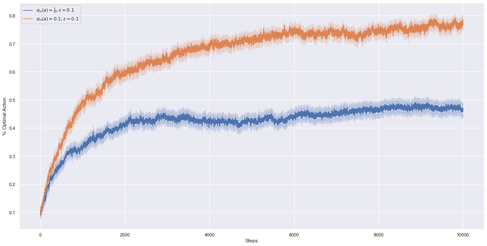

# Non-stationary Testbed

In contrast to 10-armed testbed with stationary reward distributions, we're experimenting the effects of non-stationary reward distributions (reward distributions changing over time) on sample-average methods (i.e. estimation methods for the true action values based on an empirical mean).
We will use a modified version of the 10-armed testbed where true action-values start out equal (for us they started all at 0) and then take independent random walks by adding a normally distributed increment of mean 0 and standard deviation 0.01 to all true action values on each time step.
Moreover, we use longer runs with 10000 steps (horizon) instead of 1000 and we still run everything with 2000 runs.

This experiment is for the Exercise 2.5 (page 33) of Sutton and Barto's book.

**Disclaimer:** My work is not necessarily free of mistakes. Please contact me if you see possible improvements so I can update the files.

**Note:** We broke ties randomly for the argmax instead of picking the first action all the time.

## Average reward of epsilon-greedy action-value methods on a nonstationary problem
We compare the effect of sample-average methods compared to constant step-size parameter (exponential recency-weighted average) methods for estimating action values.

Because the action-values change over time, tracking/estimating them by doing empirical means (sample-average methods) give poor estimations of the true action values.
Poor estimations of true action values lead to poor action selections and we can observe the resulting effects on the performance of both figures.

## Percentage of optimal action

**The % optimal action means : for a particular time step; how many percent out of all runs did we take an optimal action ? (recall that the action-values change over time, the optimal action can change over time)**

It does not mean this : how many percent of all previous actions (for instance if we are at step 500, how many percent of the previous 500 actions) the method took the optimal action (recall that the action-values change over time, the optimal action can change over time). To obtain this we would have to divide not everything by the 1000 but by each time step element-wise.

## Remark(s) about implementation

We always use the incremental implementation to update estimates.

